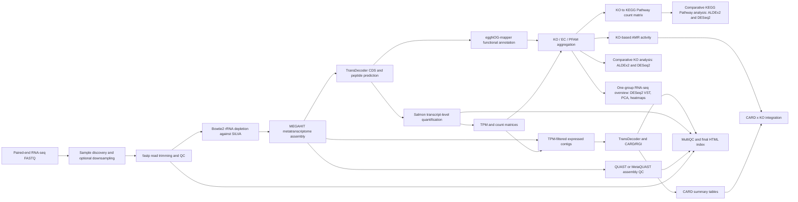

# RNA-seq Metatranscriptomic AMR Pipeline - Publication Summary

## Workflow Schematic

The workflow diagram is available as Mermaid source in:

`publication_materials/pipeline_workflow.mmd`

## Pipeline Stages

| Stage | Main operation | Main inputs | Main outputs | Core tools |
|---|---|---|---|---|
| Sample discovery | Detect paired-end FASTQ R1/R2 files; optional test-run downsampling | Raw FASTQ | `00_samples.tsv`, optional `00_test_run_downsampled/` | Python standard library |
| rRNA estimation | Estimate rRNA fraction before depletion | Raw paired FASTQ | `00_rRNA_content/rrna_content_summary.tsv` | Bowtie2, SILVA rRNA index |
| Read trimming/QC | Adapter/quality trimming and per-sample QC | Raw paired FASTQ | `01_fastp_trim_QC/fastq_clean/`, fastp HTML/JSON, MultiQC | fastp, MultiQC |
| rRNA removal | Remove reads mapping to SILVA rRNA | Clean paired FASTQ | `02_rRNA_removed/*.rRNAfree_R*.fastq.gz` | Bowtie2, SILVA rRNA index |
| rRNA stats | Summarize read retention after rRNA depletion | Raw, clean and rRNA-free FASTQ | `02a_rRNA_stats/rrna_removal_stats.tsv` | Python standard library |
| Assembly | De novo transcript assembly per sample | rRNA-free or clean reads | `03_assembly_megahit/*/final.contigs.fa` | MEGAHIT |
| Assembly QC | Assembly statistics without reference genome | Contigs | `03c_quast_metaquast/report.tsv`, MultiQC | QUAST / MetaQUAST |
| CDS prediction | Predict coding sequences and peptides | Contigs | `04a_all_cds/*.cds.fa`, `04b_all_pep/*.pep` | TransDecoder |
| CDS stats | Compare CDS count and length statistics | CDS FASTA | `05_cds_stats/cds_comparison.tsv` | Python standard library |
| Quantification | Quantify expression against sample-specific CDS | CDS FASTA and reads | `06_quant_salmon/*/quant.sf` | Salmon |
| Matrix building | Collect TPM and count matrices | Salmon `quant.sf` | `07_salmon_matrices/salmon_TPM_all.tsv`, `salmon_COUNTS_CDS_matrix.tsv` | Python standard library |
| Functional annotation | Annotate predicted proteins | Peptide FASTA | `08_eggnog/eggnog_cds.emapper.annotations` | eggNOG-mapper, DIAMOND, MMseqs2 |
| Functional aggregation | Aggregate expression by KO, EC and PFAM | Salmon matrices and eggNOG annotations | `09a_aggregate_tpm_by_eggnog/`, `09b_aggregate_counts_by_eggnog/` | Python standard library |
| KO to KEGG Pathway | Aggregate KO counts into KEGG Pathway counts | KO count matrix and eggNOG pathway annotations | `11_KO_to_KEGG_Pathway/11_COUNTS_KEGG_Pathway_matrix.tsv` | Python standard library implementation |
| Comparative analysis | Compare groups using metadata column `group_all` by default | KO and KEGG Pathway count matrices; metadata | `10_comparative_analysis/` | ALDEx2, DESeq2, apeglm |
| One-group overview | Global RNA-seq exploratory plots | CDS count matrix and metadata | VST objects, PCA, top 50/top 100 heatmaps with gene labels | DESeq2, pheatmap, ggplot2 |
| KO-based AMR | Summarize AMR-related KO abundance | KO count matrix | `14_AMR_KO/tables/AMR_activity_index.tsv` and summary tables | DESeq2-based R script plus Python fallback summaries |
| CARD/RGI | Identify AMR proteins in expressed contigs | TPM matrix and assemblies | `15_CARD/*/card_amr_*.txt` | seqtk, TransDecoder, RGI/CARD |
| CARD summary | Summarize CARD hits by ARO, mechanism and drug class | RGI output tables | `15a_CARD_analysis/tables/` | Python standard library implementation |
| CARD x KO integration | Integrate CARD and KO-derived AMR metrics | CARD summary and KO matrix | `16_interation_CARD_KO/tables/` | Python standard library implementation |
| Final report | Aggregate QC and output links | Stage output directories | `99_multiqc_all/`, `index.html` | MultiQC, Python standard library |

## Pipeline Modules / Source Scripts

These are the reference scripts catalogued by the app and used either directly through non-interactive materialized copies or as implementation references.

| Module key | Source script | Role in the app |
|---|---|---|
| `estimate_rrna` | `00_estimate_rRNA_content.sh` | rRNA content estimation reference; implemented non-interactively in Python/Bash |
| `fastp` | `01_fastp_trim_QC.sh` | fastp trimming and QC reference; implemented non-interactively |
| `remove_rrna` | `02_remove_rRNA_bowtie2.sh` | rRNA depletion reference; implemented non-interactively |
| `rrna_stats` | `02a_remove_rRNA_stats.sh` | rRNA removal statistics reference; implemented in Python |
| `megahit` | `03a_megahit.sh` | MEGAHIT assembly reference; implemented non-interactively |
| `collect_contigs` | `03b_contigs_all.sh` | Contig collection reference; implemented in Python |
| `quast` | `03c_quast_metaquast.sh` | QUAST/MetaQUAST reference; implemented non-interactively |
| `transdecoder` | `04_transdecoder.sh` | TransDecoder reference; implemented non-interactively |
| `collect_cds` | `04a_transdecoder_all_cds.sh` | CDS/PEP collection reference; implemented in Python |
| `cds_stats` | `05_compare_cds_stats.py` | CDS statistics reference; implemented in Python |
| `salmon` | `06_quant_salmon.sh` | Salmon quantification reference; implemented non-interactively |
| `salmon_tpm` | `07_collect_salmon_tpm.py` | Salmon matrix collection reference; implemented in Python |
| `eggnog` | `08_eggnog_mapper2.sh` | eggNOG-mapper reference; implemented non-interactively |
| `aggregate_tpm` | `09a_aggregate_tpm_by_eggnog.py` | TPM aggregation reference; implemented in Python |
| `aggregate_counts` | `09b_aggregate_counts_by_eggnog.py` | Count aggregation reference; implemented in Python |
| `compare_ko_aldex2` | `10a_DEG_KO_ALDEx2.R` | Materialized and run for KO ALDEx2 comparative analysis |
| `compare_ko_deseq2` | `10b_DEG_KO_DeSeq2.R` | Materialized and run for KO DESeq2 comparative analysis |
| `compare_pathway_aldex2` | `10a_DEG_KEGG_Pathway_ALDEx2.R` | Materialized and run for KEGG Pathway ALDEx2 comparative analysis |
| `compare_pathway_deseq2` | `10b_DEG_KEGG_Pathway_DeSeq2.R` | Materialized and run for KEGG Pathway DESeq2 comparative analysis |
| `kegg_pathway` | `11_KO_to_KEGG_Pathway.R` | KO to KEGG Pathway reference; implemented in Python |
| `rnaseq_overview` | `13_RNAseq_one_group_analysis.R` | Materialized and run for DESeq2/VST/PCA/heatmaps |
| `amr_ko` | `14_AMR_KO.R` | Materialized and run for KO-based AMR analysis; Python summary tables are also written |
| `card_rgi` | `15_CARD_RGI_protein.sh` | CARD/RGI reference; implemented non-interactively |
| `card_analysis` | `15a_CARD_analysis.R` | CARD summary reference; implemented in Python |
| `card_ko` | `16_interation_CARD_KO.R` | CARD x KO integration reference; implemented in Python |

## MultiQC Modules

| MultiQC report | Input directories | Modules expected |
|---|---|---|
| fastp report | `01_fastp_trim_QC/reports` | fastp |
| QUAST report | `03c_quast_metaquast` | QUAST |
| final report | fastp reports, QUAST directory, Salmon directories, CARD directories | fastp, QUAST, Salmon; additional detectable modules if present |

## Computational Environments

| Environment | Path | Used for |
|---|---|---|
| System Python | `/usr/bin/python3` or active `python3` | Pipeline app, file parsing, matrix aggregation, summaries, local HTML server |
| System R | `/usr/bin/Rscript` | R analyses using packages installed under `/data/R`; selected to match R 4.5.x package builds |
| QC / assembly env | `/data/conda_envs/metagenomics_base` | fastp, MultiQC, Bowtie2, MEGAHIT |
| Metatranscriptomics env | `/data/conda_envs/metatrascriptomics_base` | TransDecoder, Salmon |
| QUAST env | `/data/conda_envs/nanopore_assembly` | QUAST / MetaQUAST |
| eggNOG env | `/data/conda_envs/eggnog_mapper_v2` | eggNOG-mapper, DIAMOND, MMseqs2 |
| CARD env | `/data/conda_envs/card` | RGI, CARD-related searches, seqtk |

## Command-line Tools and Versions

| Tool | Version observed locally | Environment |
|---|---:|---|
| Python | 3.10.12 for the app runtime | system |
| R | 4.5.3 | `/usr/bin/Rscript` |
| fastp | 1.0.1 | `metagenomics_base` |
| MultiQC | 1.34 | `metagenomics_base` |
| Bowtie2 | 2.5.4 | `metagenomics_base` |
| MEGAHIT | 1.2.9 | `metagenomics_base` |
| QUAST / MetaQUAST | 5.3.0 | `nanopore_assembly` |
| TransDecoder | 5.7.1 | `metatrascriptomics_base` |
| Salmon | 1.10.3 | `metatrascriptomics_base` |
| eggNOG-mapper | 2.1.13 | `eggnog_mapper_v2` |
| DIAMOND | 2.0.15 for eggNOG-mapper; 2.1.21 in CARD env | `eggnog_mapper_v2`, `card` |
| MMseqs2 | 16.747c6 | `eggnog_mapper_v2` |
| RGI | 3.2.1 | `card` |
| BLAST | 2.17.0 | `card` |
| seqtk | available, version not reported by local binary | `card` |

## R Packages

| R package | Version observed locally | Used for |
|---|---:|---|
| ALDEx2 | 1.40.0 | Group-wise compositional differential abundance |
| DESeq2 | 1.48.2 | Count normalization, VST, differential expression |
| apeglm | 1.30.0 | DESeq2 log-fold-change shrinkage |
| tidyverse | 2.0.0 | R data import, transformation and plotting in source scripts |
| ggplot2 | 4.0.0 | PCA, volcano plots, summary plots |
| dplyr | 1.1.4 | Data manipulation |
| readr | 2.1.5 | TSV/CSV input and output |
| stringr | 1.5.2 | String handling |
| matrixStats | 1.5.0 | Row-wise variance and summary statistics |
| pheatmap | 1.0.13 | Heatmaps |
| janitor | 2.2.1 | Reference CARD scripts; column-name cleaning |
| FactoMineR | 2.13 | Reference CARD scripts; PCA |
| factoextra | 1.0.7 | Reference CARD scripts; PCA visualization |
| Biobase | 2.68.0 | Bioconductor dependency |
| S4Vectors | 0.46.0 | Bioconductor dependency |
| SummarizedExperiment | 1.38.1 | Bioconductor dependency |

## Databases and Reference Resources

| Resource | Local path / source | Used for |
|---|---|---|
| SILVA 138.2 rRNA Bowtie2 index | `/data/bazy/metaTP/SILVA_138_2_rRNA` | rRNA estimation and depletion |
| eggNOG data directory | `/data/bazy/eggnog` | Functional annotation by eggNOG-mapper |
| CARD / RGI database | RGI default database in `/data/conda_envs/card` | AMR protein identification |

## Key Parameters Currently Encoded in the App

| Parameter | Default/current value | Notes |
|---|---:|---|
| fastp mode | adapters + cut_front/cut_tail + Phred/min length | User configurable |
| fastp Phred threshold | 20 | User configurable |
| fastp minimum read length | 50 bp | User configurable |
| rRNA Bowtie2 mode | `--end-to-end --very-sensitive -L 31 -N 0 --score-min L,0,-0.6` | Used for both estimation and depletion |
| MEGAHIT k-list | `21,41,61,81,101,121` | User configurable |
| MEGAHIT minimum contig length | 300 bp | User configurable |
| QUAST minimum contig length | 200 bp | QUAST/MetaQUAST report |
| Salmon library type | `-l A` | Automatic library type detection |
| TPM threshold for expressed contigs/CARD | 1.0 | User configurable |
| Comparative grouping column | `group_all` | Metadata column used for ALDEx2 and DESeq2 grouping |
| RNA-seq overview filtering | count >= 10 in at least 2 samples | Inherited from source R script |
| DESeq2 size factors for sparse matrices | `type = "poscounts"` / `sfType = "poscounts"` | Added for sparse metatranscriptomic count matrices |
| RNA-seq heatmaps | top 50 and top 100 variable genes | Gene names shown; gene clustering disabled; sample clustering enabled |
| CARD/RGI cutoff | loose RGI mode, summary keeps Strict and Loose by default | User configurable summary cutoffs |